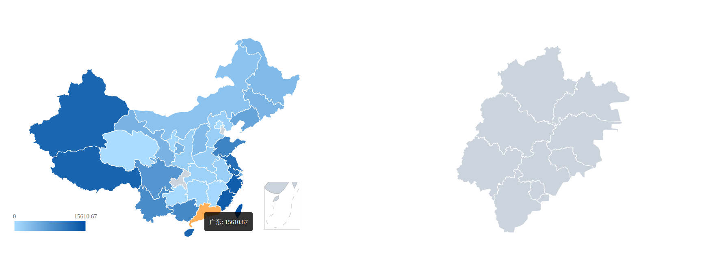

# ChinaMap

This is a China map,which based on d3.js.

Draw maps of China and provinces based on d3.js.
Support the calculation of gradient color based on data to render the background of each province.
Support moving the mouse to display the name and data of the province.
Click the province to display the map of the province.

## Demo

## Usage

1. Download
2. npm install installation
3. `npm run start` startup project
4. Access localhost: 3000

## Project

- node_modules folder contains all the dependent packages of the project.
- public folder contains the static resource files of the project,
- views folder contains the view components of the project.
- package.json contains the project information and the list of dependent packages.
- package-lock.json contains the version information of all dependent packages of the project.
