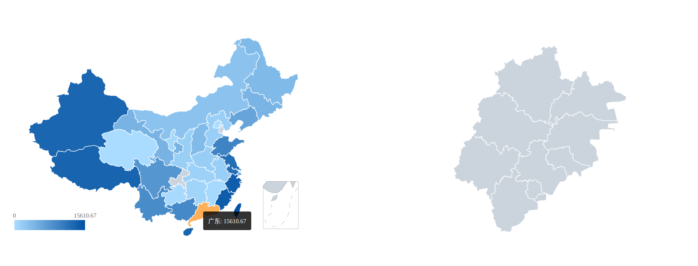

# 中国地图

这是一张中国地图，其中地理信息包含省份数据和城市数据,数字信息来源于知识图谱。
本项目基于 d3.js 绘制中国和各省的地图。
本项目支持基于数据计算渐变颜色，以渲染每个省份的背景。
本项目支持移动鼠标以显示省的名称和数据,可单击省以显示省的地图。

## Demo 演示

## 用法：

- 下载
- 安装 npm
- `npm run start`启动项目
- 访问 localhost:3000

## 项目

-nodemodules 文件夹包含项目的所有依赖包。
-public 文件夹包含项目的静态资源文件，
-views 文件夹包含项目的视图组件。
-package.json 包含项目信息和依赖包列表。
-package-lock.json 包含项目所有依赖包的版本信息。
